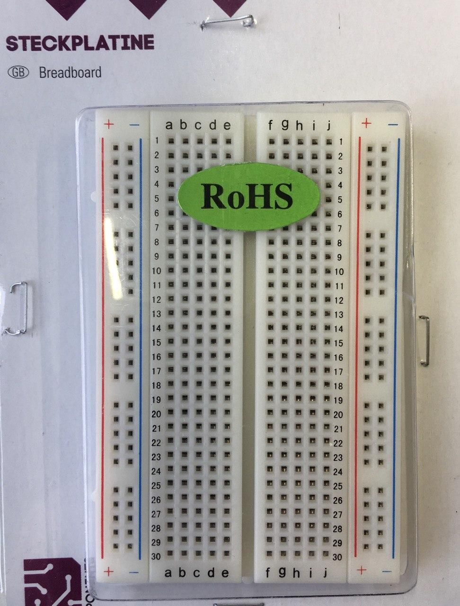
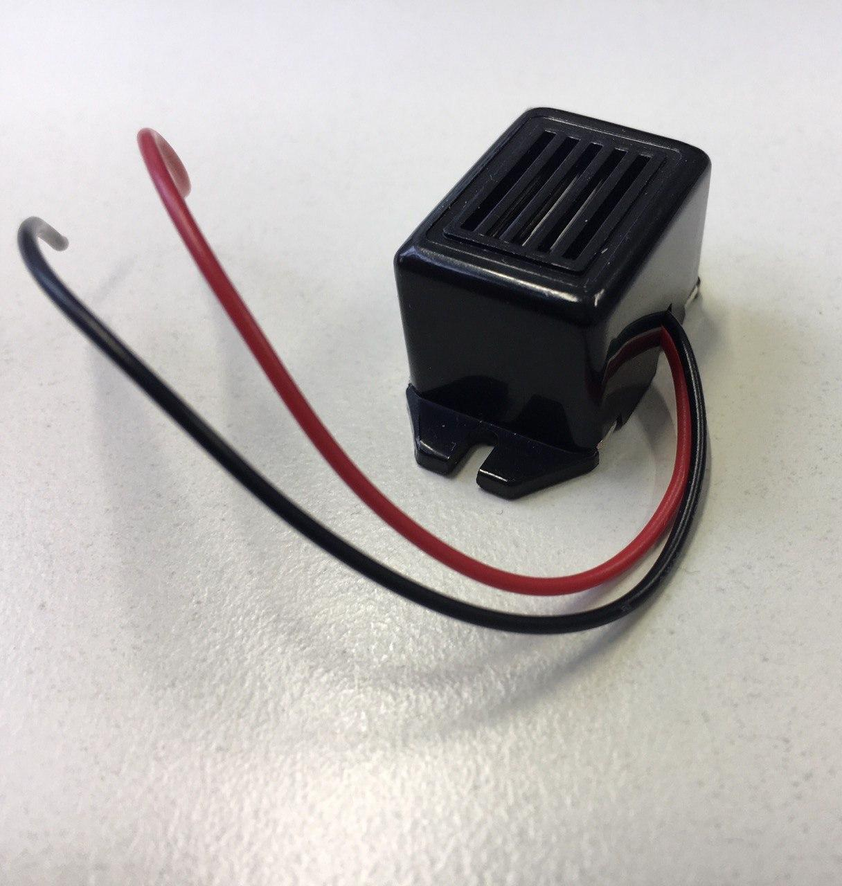
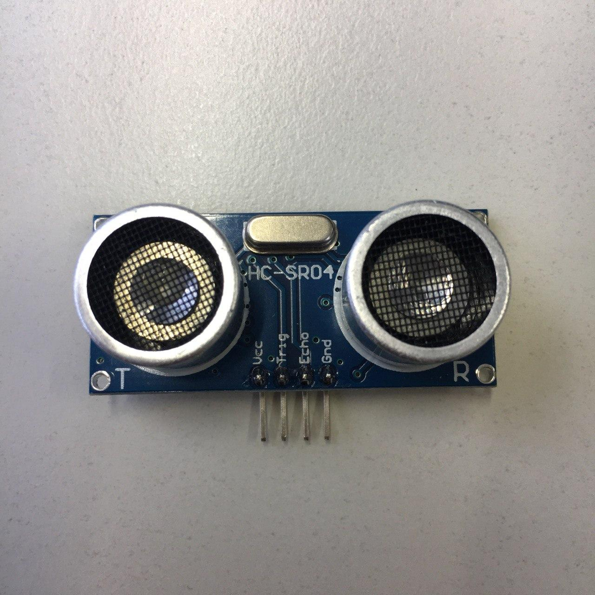

Ein einfacher [Theremin](https://en.wikipedia.org/wiki/Theremin) programmiert mit ein Raspberry Pi: 
- Status: One Raspbarry Pi is missing, ask Leon
- Difficulty: **2/5**

### Bestellliste

| Menge | Name            | Beschreibung                       | Beschriftung/Farbcode |
|-------|-----------------|------------------------------------|-----------------------|
|||||

### Parts List für 10 Teilnehmemer*innen

| Menge | Name            | Beschreibung                       | Beschriftung/Farbcode |
|-------|-----------------|------------------------------------|-----------------------|
| 5     | Raspberry Pi 3             | kleine single-board Computer	mit Stromanschluss	               |                       |
| 5     | Piezoememet  |  verändert sein Form jenach angelegter Spannung und kann einen Ton erzeugen |    KEPO                   |
| 5     | Steckplatine  |   zum Verbinden von Schaltkreisen                                 |                       |
| 5     | Ultraschallsensor             |  zum Untraschlalwellen senden und messen          |                       |
| 60     | Jumperkabel            |   zum verbinden der electrischen Komponenten, 5 mal out-out, 55 mal in-out                               |                       |
| 5    | Kondensatoren | R-R-R-Gold 2.2k\Omega |     |
| 5    | Kondensatoren | Braun-R-R-Gold 1.2k\Omega |     |
| 5    | Bildschirm |  |     |
| 5    | Tastatur |  |     |
| 5    | Maus |  |     |

### Steckplatine

### Piezo Element

### Ultraschallsensor

